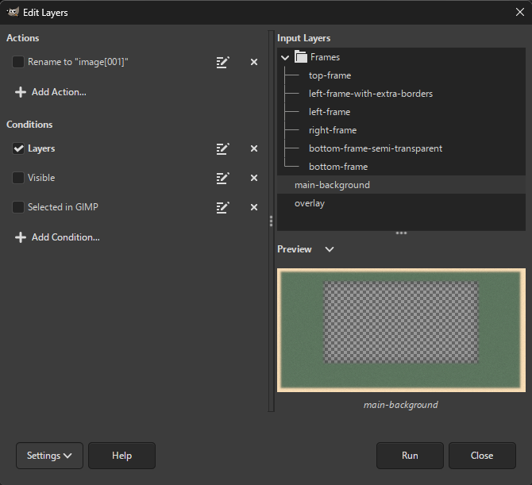
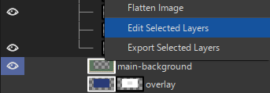

## Batch Image Conversion

In GIMP, select `File → Batch Convert...`.

A dialog appears that allows you to add input files and folders and adjust export settings, such as the output folder, filenames and the file extension.

To start batch conversion, simply press the `Run` button.

For information on the export settings, see [Adjusting Export Settings](#adjusting-export-settings) below.
Image names are used as filenames by default.

For information on procedures and constraints, see [Procedures and Constraints](#procedures-and-constraints) below.

You can add files and folders in one of the following ways:
* Drag and drop images and folders from a file explorer application to the area under `Input Images`.
* Copy and paste images and folders from a file explorer application to the area under `Input Images`. Note that you must click on the area first.
* Copy and paste images and folders from a text file, each on a separate line to the area under `Input Images`. Note that you must click on the area first. Any files and folders that do not exist are ignored.
* Press the `Add Files...` or `Add Folders...` button to select and add files or folders, respectively.

Files with a file extension not recognized by Batcher will be filtered by default. If you use a third-party file load plug-in, uncheck `Recognized file formats`.

You will be warned if you add folder(s) containing too many files or e.g. an entire drive. This is a safeguard against accidentally adding an undesired folder.

You can remove input images and folders by selecting them and pressing Delete or the `Remove` button. You can clear the entire input list by pressing the `Remove All` button or selecting everything with Ctrl + A and then pressing Delete.

By default, the renamed images (as they would be named on export) are displayed. To show their original names, simply check `Show Original Names`.

## Exporting Layers

Open an image in GIMP and select `File → Export Layers...`.

A dialog appears that allows you to adjust export settings, such as the output folder, filenames and the file extension.

To export layers, simply press the `Export` button.

For information on the export settings, see [Adjusting Export Settings](#adjusting-export-settings).
Layer names are used as filenames by default.

For information on procedures and constraints, see [Procedures and Constraints](#procedures-and-constraints) below.

## Quick Export of Layers

If you made changes to your image, and you want to export again with the same settings, or you need a simple export without customization, you can run `File → Export Layers (Quick)`.

For the first time, a small dialog with only export settings is displayed, where you can adjust the basic export settings.

This dialog can be skipped by simply unchecking `Show this dialog`.

Note that even procedures and constraints set up in the `Export Layers` dialog will be applied for `Export Layers (Quick)`, even if they are not shown.

## Quick Export of Selected Layers

When you select multiple layers in GIMP, you can right-click and select `Export Selected Layers` to quickly export the selected layers.

In this case, any constraints set in the [main dialog](#exporting-layers) will be ignored.

## Batch Editing Layers

Open an image in GIMP and select `File → Edit Layers...`.

To run batch editing, simply press the `Run` button.

This is where you leverage the power of [procedures and constraints](#procedures-and-constraints).
The procedures will be applied to each layer in the current image satisfying the chosen constraints.
You can take a look at a few [examples](Customization.md#examples) to get started.

If the `Layers` constraint is unchecked, group layers will also be processed. The group layers will be copied and inserted as regular layers to work around the fact that some procedures cannot be applied on group layers.

## Quick Batch Layer Editing

You can run batch editing in a single click by running `File → Edit Layers (Quick)`.
This can be useful if you made changes to your image and you want to run batch editing again with the same settings.

## Quick Batch Editing of Selected Layers

When you select multiple layers in GIMP, you can right-click and select `Edit Selected Layers` to quickly edit the selected layers.

In this case, any constraints set in the [main dialog](#batch-editing-layers) will be ignored.

## Adjusting Export Settings

### Changing Filenames

The text entry next to `Name` lets you customize the filenames. A popup offers you several patterns you can combine to create the final filename, such as the image name, a numbered sequence, and more.

For details, see [Adjusting Filenames](Customization.md#adjusting-filenames).

### Changing File Extension

Type or choose your desired file extension next to the filename entry (`png` by default).

The dropdown list displays available file formats alongside their associated file extensions.
If a file format contains multiple file extensions, the first is selected by default, but you may also choose a different extension (by clicking on it or pressing Tab).

For now, the dropdown only contains a fixed list of file formats provided by GIMP.
However, you can still enter a file extension not in the list in case you use a third-party file export plug-in.

### Export Options

Pressing the `Options...` button reveals additional export options, particularly file format options (compression for PNG, image quality for JPG, etc.).

If you need to adjust options for a file format not recognized by Batcher, set `How to adjust file format options` to `Interactively`.
You will be prompted to set the file format options right after you start batch processing.

All options are described in [Export Options](Customization.md#export-options).

## Procedures and Constraints

Before the start of batch processing, you can apply a multitude of *procedures* to each image/layer, such as scaling, background insertion, any layer effect or GIMP plug-in.

You can exclude images/layers from being processed/exported based on one or more *constraints* (only filenames matching a suffix, only visible layers, ...).

Procedures and constraints can be a powerful way to adjust batch processing to your heart's content.
You can take a look at a few [examples](Customization.md#examples) to get started.

The names under Input Images/Input Layers and the image preview are automatically updated as you adjust the procedures and constraints.

For details, see [Procedures](Customization.md#procedures) and [Constraints](Customization.md#constraints).

## Preview

The image preview displays the contents of the selected image/layer.

You can adjust the width of the entire pane containing the input list and the preview by dragging the separator between the preview and the procedures/constraints.
You can also adjust the height of the previewed image by dragging the separator above the image.

If the previewed image takes too long to render, the preview is no longer updated automatically.
A refresh button above the image is displayed that allows you to manually update the image.
To switch between automatic and manual update, press the arrow button and select `Update Image Preview Automatically`.

Note that the preview is only an approximation of what the exported image will look like.
For example, for the JPEG format, which does not support transparency and may result in visible compression artifacts, the preview will show a transparent image without artifacts.

## Managing Settings

Once batch processing is done successfully, your settings (output folder, file extension, dialog size, procedures, constraints, etc.) are automatically saved.
You can save settings manually anytime by selecting `Settings → Save Settings` or pressing Ctrl + S anywhere in the dialog.
To reset settings to their default values, select `Settings → Reset Settings`.

You may also save settings to a custom file by selecting `Settings → Save Settings to File...`.
This allows swapping between different plug-in configurations or sharing them.
To load settings from a file, select `Settings → Load Settings from File...` and select the file.

You can turn auto-closing the main dialog on/off by checking/unchecking `Settings → Close when Done`.

For Batch Convert, you can optionally turn off saving input images by unchecking `Settings → Keep Input Images`. When this setting is checked, `Reset Settings` will not remove the input images. When loading settings from a file and this setting is checked, the input images will be preserved and any input images stored in the file will be ignored. If you want to load the input images from the file, uncheck this setting.

## Known Issues

If the *How to adjust file format options* export option is set to `Interactively`, and you press the Export button, it may seem as though nothing happens.
In that case, the file format dialog may be displayed behind GIMP.
If so, simply select the dialog in the taskbar to bring it up.

The following file formats require displaying a file format dialog for each image to be exported:
* C source,
* HTML.

On Windows, exporting with the following file formats does not work properly if file paths contain accented (Unicode) characters:
* X PixMap Image.
